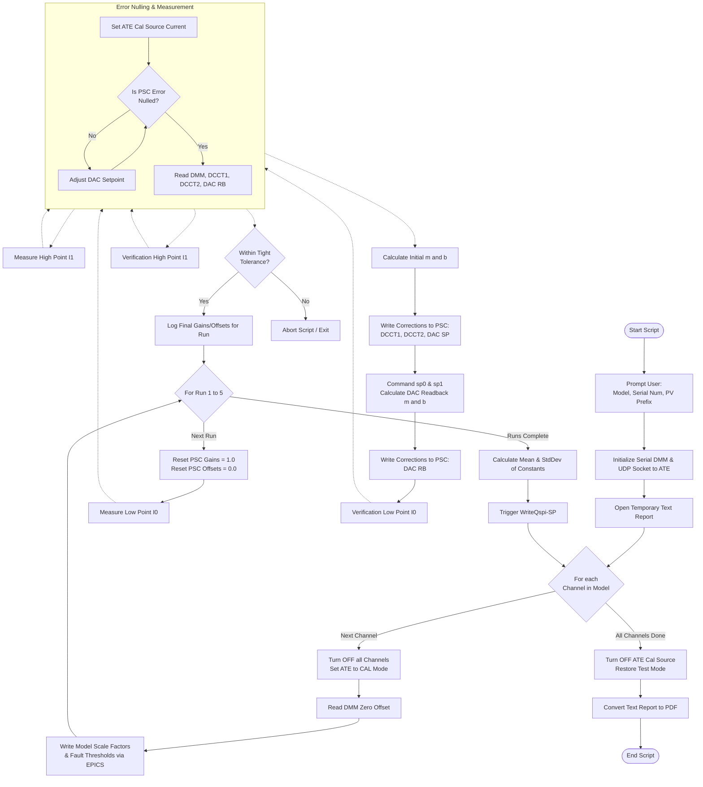

# ALSu PSC Automated Calibration Script
ALS-U PSCs, a.k.a. zPSCs, use either 18-bit or 20-bit digital to analog converters (DACs) for the power supply current setpoint reference and 18-bit or 20-bit analog to digital converters (ADCs) for readback of DCCT current measurements. Uncalibrated accuracy of PSCs is at the level of 0.5 %, so calibrations of PSC DACs and ADCs are performed to improve regulation and readback accuracy to the level of 20 ppm. Selectable averaging modes in the PSC further reduce measurement variation in DCCT readback data.

Taken altogether, calibrated accuracy, engineered stability, traceability to accredited electrical standards, selectable integration times, and waveform capture functions confer measurement capability to the PSC approaching that of a laboratory grade 6.5 digit digital multimeter (DMM) for high precision power supply control and diagnostics.


This repository contains the production Python script used for the automated calibration of the ALSu Power Supply Controllers (PSC). It interfaces directly with the PSC via EPICS, an ATE (Automated Test Environment) chassis via UDP sockets, and an HP 3458A Digital Multimeter (DMM) via RS-232 serial communication.

## Table of Contents
1. [Overview](#overview)
2. [Hardware Requirements](#hardware-requirements)
3. [Software Dependencies](#software-dependencies)
4. [Usage](#usage)
5. [Detailed Calibration Process](#detailed-calibration-process)
6. [Calibration Flowchart](#calibration-flowchart)

---

## Overview

This script automates the high-precision calibration of the DACs and ADCs (DCCT1, DCCT2, DAC Readback) onboard the ALSu PSC. It utilizes a highly accurate HP 3458A DMM as the gold standard reference. 

Upon launching, the script prompts the user to select the specific hardware model from a registry of 15 configurations. It then sequentially iterates through each physical channel of the unit. For each channel, it performs 5 measurement runs, applying test currents, measuring the response, computing linear correction factors (Gain and Offset), applying them to the PSC, and strictly verifying the final calibrated accuracy. 

At the end of the sequence, the script commits the new averaged calibration constants to the PSC's onboard QSPI non-volatile memory and generates a formatted PDF calibration report.

---

## Hardware Requirements

* **ALSu Power Supply Controller (PSC):** Connected to the local EPICS network.
* **ATE Chassis:** Connected to the network (IP: `10.69.26.3` by default), receiving UDP commands on port 5000 to route calibration currents.
* **HP 3458A Digital Multimeter:** Connected via RS-232/Serial to the host machine (configured at `/dev/ttyUSB0`).
* **Cabling:** Appropriate test stand wiring routing the ATE calibration source through the DMM and into the PSC under test.

---

## Software Dependencies

Ensure the following Python packages are installed:
```bash
pip install numpy pyepics pyserial reportlab
```
*Note: An active EPICS environment must be sourced and running on the host machine to allow the `caget` and `caput` commands to resolve the PSC Process Variables (PVs).*

---

## Usage

1. Power on the ATE, PSC, and HP 3458A DMM. Ensure network and serial connections are physically established. Ensure the DMM is self-calibrated at least once daily. Ensure PSC has 'warmed up' - at least 15-20 minutes. 
2. Run the script:
   ```bash
   python3 pscCALdib.py
   ```
3. Follow the interactive console prompts:
   * Select the PSC Model (1-15).
   * Enter the 4-digit chassis Serial Number.
   * Enter the PSC Number (e.g., `5` to target EPICS prefix `lab5Chan:`).
4. The script will execute autonomously. Ensure the test stand is undisturbed while the script switches relays and takes high-precision measurements.
5. Upon completion, retrieve the generated PDF report in the designated `cal_reports` directory.

---

## Detailed Calibration Process

The calibration logic utilizes a standard two-point linear fit equation: **$y = mx + b$**, where $m$ is the gain multiplier and $b$ is the DC offset.

For each channel, the script performs 5 runs (`N=5`) to ensure statistical stability. The process for a single channel is executed as follows:

### 1. Initialization & Baselining
* The script disables all channel outputs.
* The ATE routes its internal switches to place the target channel into CAL mode via UDP.
* A baseline "zero offset" reading is taken directly from the HP 3458A DMM to account for ambient noise/drift. 
* The PSC's EPICS Scale Factors (Amps/Sec, Vout, Spare) and safety Fault Limits (OVC, OVV) are written based on the selected hardware model.

### 2. Gain/Offset Reset
* At the start of each run, all PSC internal Gain PVs are forced to `1.0` and Offset PVs to `0.0`. This strips away any prior calibration data.

### 3. Measurement Low ($I_0$) & Error Nulling
* The ATE DAC is commanded via UDP to drive a low baseline current ($I_0$).
* **Error Nulling Loop:** The script commands the PSC DAC to the expected theoretical setpoint, waits for the hardware to settle, and reads the PSC's internal Error value (`Error-I`). It iteratively tweaks the DAC setpoint (`sp = sp - err/400*G`) until the physical hardware Error loop is nulled (driven to near-zero).
* Once nulled, the script records the true high-precision DMM reading, the actual driven DAC setpoint, and the internal ADC readings (DCCT1, DCCT2, DAC Readback).

### 4. Measurement High ($I_1$)
* The ATE DAC is commanded to drive a high current (approx 90% of the maximum burden current).
* The exact same error nulling loop is repeated, and the high-point variables are recorded.

### 5. Correction Calculation & Application
* The script calculates the slope ($m$) and offset ($b$) between the expected DMM reference points and the raw ADC points.
* The correction constants (`1/m` for gain, `b` for offset) are written via EPICS to the PSC's `DCCT1`, `DCCT2`, and `DACSetPt` parameters.

### 6. DAC Readback Calibration
* With the primary control and feedback paths calibrated, the script commands two raw DAC setpoints (`sp0` and `sp1`), measures the secondary DAC Readback ADC, calculates its specific gain/offset, and writes them to the PSC.

### 7. Verification Step
* The script repeats the Low and High measurement loops. Because the PSC now has active correction constants applied, the measured error between the reference DMM and the PSC ADCs should be nearly zero. 
* The pass threshold is tightened significantly (from `0.02` down to `0.0002`). If the unit fails this strict verification, the script aborts.

### 8. Statistical Averaging & Save
* After all 5 runs are complete, the script calculates the Mean and Standard Deviation of the final gains and offsets.
* A command is sent to the PSC (`WriteQspi-SP`) to permanently burn the new averaged calibration constants into non-volatile flash memory.

---

## Calibration Flowchart

