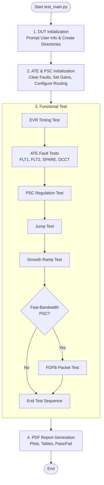

# **PSC Automated Test Environment (ATE) – Test Suite**

This repository contains the full automated test environment (ATE) and reporting framework for **ALSu Power Supply Controller (PSC)** validation.  
It performs end-to-end testing of PSC hardware, ATE interfaces, EVR timing, DCCT/IGND/SPARE regulation, FOFB behavior, and produces a formatted PDF report for shipment documentation.

The system integrates:

- **PSC EPICS IOC communication** (`EPICS_Adapters/psc_epics.py`)
- **ATE Tester IOC communication** (`EPICS_Adapters/ate_epics.py`)
- Automated test modules (jump, smooth ramp, regulation, EVR timing, FOFB)
- Auto-generated reports with plots and pass/fail tables
- Automated directory management and shipment logging

---

## **Repository Structure**

```text
ALSU-PSC_CAL-AND-TEST-SUITE/
├── Launcher.py             # Main entry point for the application
├── Cal/                    # Calibration-specific logic and instruments
│   ├── cal_main.py         # Primary calibration orchestration
│   └── Instruments/        # Driver support for DMMs (HP 3458A)
│     ├── hp_3458a.py                  #  Driver for HP 3458A DMM
│     └── keithley_2401.py             #  Driver for Keithley 2401 SMU (Deprecated)
├── Common/                 # Shared utilities and hardware adapters
│   ├── initialize_dut.py   # DUT class (Session management & Path anchoring)
│   ├── psc_models.py       # Registry of PSC hardware specifications
│   └── EPICS_Adapters/     # Low-level EPICS communication layers
│     ├── ate_epics.py                 # Driver: Robust adapter for ATE Tester IOC
│     └── psc_epics.py                 # Driver: Adapter for PSC IOC (waveforms, setpoints)
├── Test/                   # Functional verification suite
│   ├── main.py             # Primary test orchestration
│   └── Functional_Tests/   # Specific test modules (Regulation, Ramp, etc.)
│     ├── ate_fault_tests.py           # Hardware Interlock Validation (FLT1/2/Spare/DCCT)
│     ├── evr_timing_test.py           # EVR 1Hz Timestamp monotonicity check
│     ├── fofb_test.py                 # FOFB Integration: UDP packet capture & HDF5 logging
│     ├── jump_test.py                 # Transient Response Analysis (Step response, Settling)
│     ├── ps_regulation_test.py        # DAC Loopback & Regulation verification
│     ├── smooth_ramp_test.py          # Ramp Tracking & Stability Analysis
│     ├── caen_fast_genpacket.c        # Low-level UDP packet generator (C source)
│     └── caen_fast_genpacket_loop_inf.sh  # Shell script wrapper for continuous packet generation
└── Test_And_Cal_Data/      # Unified data repository
    ├── Cal_Reports/        # Auto-generated calibration PDFs
    ├── Test_Reports/       # Auto-generated functional test PDFs
    └── Raw_Logs/           # Diagnostic raw data indexed by Shipment ID
```

---

## **Overview of the Test Flow**

The main entry point is:

```bash
python3 main.py
```

### **Testing Process Flowchart**



### **Sequence Breakdown**

1. **DUT Initialization**
   - User enters serial number, shipment number, operator, etc.
   - Creates a new `Shipment #XX/` directory.
   - Creates raw data and PDF report folders.

2. **ATE & PSC Initialization (`ate_init.py`)**
   - Clears faults and resets PSC.
   - Configures IGND routing and DCCT channels.
   - Configures gains, polarity, and calibration state.

3. **Tests Executed**
   - **EVR Timing Test**
   - **ATE Fault Tests:** FLT1, FLT2, SPARE, and DCCT fault injection.
   - **PSC Regulation Test**
   - **Jump Test**
   - **Smooth Ramp Test**
   - **FOFB Packet Test:** *(fast-bandwidth PSC only)*.

4. **PDF Report Generation**
   - Plots of all waveforms.
   - Pass/Fail tables.
   - EVR timestamp plot.
   - FOFB results (if applicable).
   - Auto-naming based on DUT info.

---

## **Key Modules**

### **`EPICS_Adapters/psc_epics.py`**
Handles PSC-specific PV interactions:
- DAC/SP, GND/SP, MODE, RATE.
- DCCT1/2 waveforms.
- IGND readbacks.
- Snapshot triggers and waveform extraction.
- Fault masks, resets, live & latched faults.

### **`EPICS_Adapters/ate_epics.py`**
Abstraction layer for the ATE tester IOC:
- Sets IGND channel and IGND setpoint.
- DCCT fault routing.
- Fault injection (FLT1, FLT2, Spare, PCFault).
- Tester2 command interface.
- Tester status readback.

### **`Functional_Tests/ate_fault_tests.py`**
Fault injection & verification:
- Checks live + latched fault bits.
- Uses bit masks (0x80, 0x100, 0x200, 0x40).
- Clears faults and verifies zero state.
- Builds Pass/Fail report table.

### **`Functional_Tests/jump_test.py`**
Transient measurement of PSC performance:
- Detects fast transitions (diff → argmax).
- Extracts pre/post transition windows.
- Plots DAC, DCCT1/2, ERR, REG, VOLT, GND, SPARE.

### **`Functional_Tests/smooth_ramp_test.py`**
Smooth-ramp behavior & loop stability:
- Slow directional ramps (positive/negative).
- IGND stability verification.
- DCCT and ERR tracking.

### **`Functional_Tests/ps_regulation_test.py`**
Regulation loop stability tests:
- DAC and Regulation waveform capture.
- Overshoot/settling visualization.

### **`Functional_Tests/evr_timing_test.py`**
Verifies EVR 1 Hz timestamps increment correctly.

### **`Functional_Tests/fofb_test.py`**
Daisy packet monotonicity test:
- Uses CAEN generator (C version + shell script).
- Validates packet ordering & RX timing.

---

## **Installation**

Install Python dependencies:

```bash
pip install -r requirements.txt
```

Includes:
- `numpy`
- `matplotlib`
- `pyepics`
- `reportlab`
- `h5py`

## **Compile the Packet Generator**
If utilizing the FOFB tests, you must compile the C generator and configure the script permissions:
1. Compile `caen_fast_genpacket.c` to `caen_fast_genpacket`.
2. Set `caen_fast_genpacket_loop_inf.sh` to executable (`chmod +x`).

---

## **Supported Environment**

- Python **3.10+**
- EPICS Channel Access available on the network
- Access to PSC IOC and ATE Tester IOC

---

## **Output Directory Structure**

Every test run creates structured output within the root data directory:

```text
Test_And_Cal_Data/
└── Shipment #{N}/           # Generated if it does not yet exist
    ├── Raw_Data/            # PNG waveform images and CSV logs
    └── Test_Report_{SN}.pdf # Final auto-generated report
```

---

## **Contact**
Maintainer: **Michael Capotosto** NSLS-II Diagnostics & Instrumentation Group  
Brookhaven National Laboratory